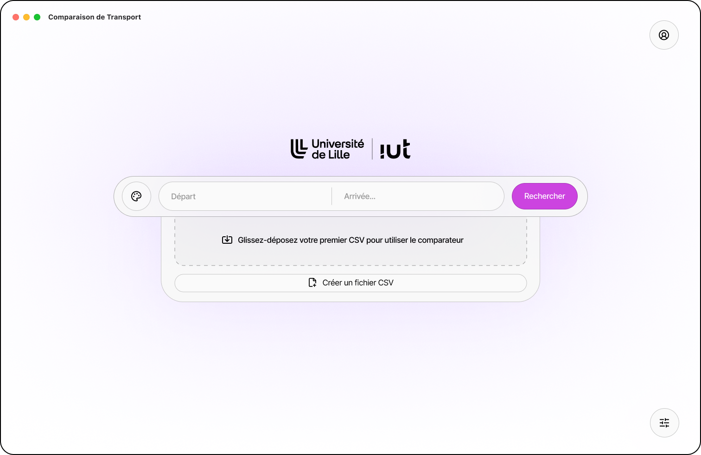
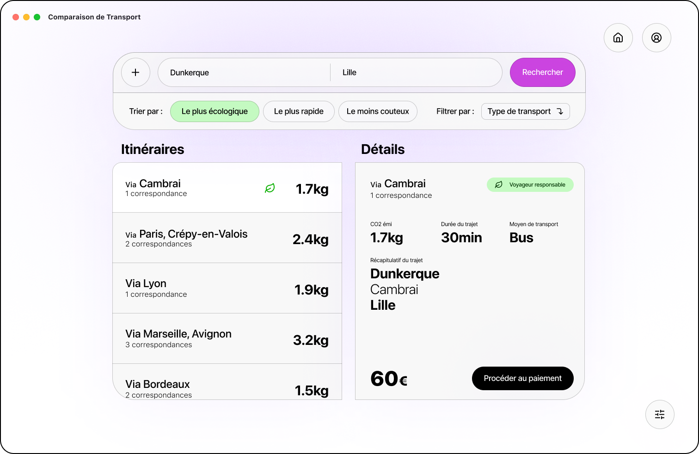
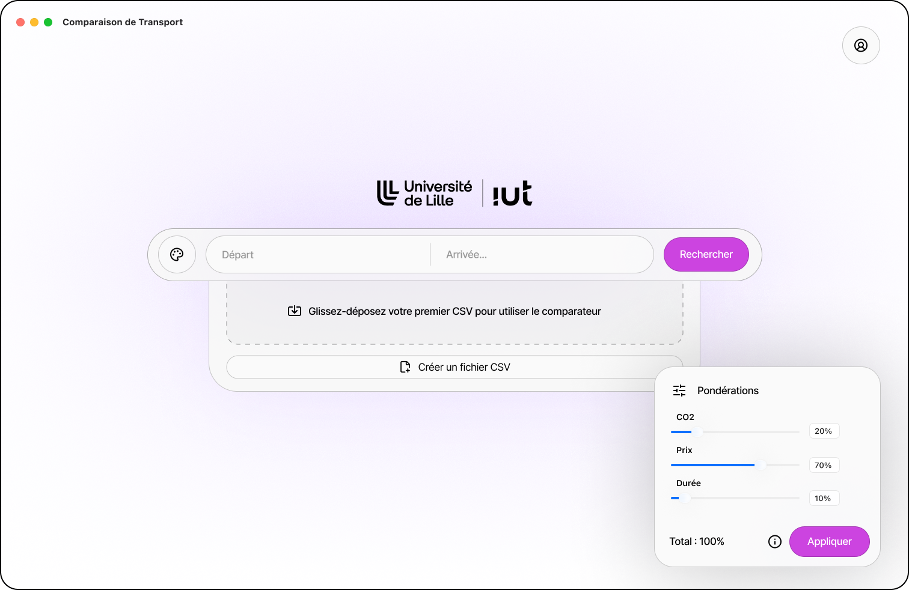

# SAÉ 2.01-2.02 — Compte rendu IHM
**Yann Renard, Tom Cox, Alexandre Sorel — Groupe E, Équipe E5 — Juin 2026**

**Lien GitLab :** https://gitlab.univ-lille.fr/sae2.01-2.02/2026/E5
**Lien GitHub (miroir) :** https://github.com/yannouuuu/IUT-SAE2.01-2.02-RDBL

---

## 1  Capture d'écran de l'application finale

L'application finale reprend fidèlement les maquettes haute fidélité réalisées sur Figma. L'interface présente une fenêtre desktop avec un fond dégradé mauve/violet, une barre de recherche centrale arrondie, et un système de vues flottantes (overlay) pour les actions secondaires.







---

## 2  Description des écrans

L'application est composée de 8 vues réparties en deux catégories : les vues principales (navigation par changement de scène) et les vues flottantes (overlay superposé à la vue courante).

**Tableau 1 : Vues de l'application**

| Vue | Type | Fonctionnalités |
|---|---|---|
| `HomeView` | Vue principale | Barre de recherche départ/arrivée avec autocomplétion, import CSV par drag & drop, création de fichier CSV, accès aux vues flottantes |
| `ResultsView` | Vue principale | Liste d'itinéraires avec tri (écologique/rapide/moins cher), filtres par modalité, panneau détail avec CO2/durée/prix, ajout à l'historique |
| `HistoriqueView` | Vue principale | Tableau des voyages effectués, détail par trajet, suppression |
| `GestionCSVView` | Modale | Création et édition de fichier CSV avec tableau éditable, validation en temps réel, sauvegarde |
| `PonderationsView` | Overlay flottant | Sliders CO2/Prix/Durée avec total 100%, expression des préférences multi-critères (V3), bouton Appliquer/Annuler |
| `CompteView` | Overlay flottant | Connexion par nom d'utilisateur, déconnexion, accès à l'historique personnel |
| `ApparenceView` | Overlay flottant | Basculement mode sombre/clair, choix du thème de couleur d'accent |

---

## 3  Justification des choix de conception

### 3.1  Critères de Scapin & Bastien

**Guidage**

La barre de recherche est l'élément central et le plus visible de l'interface — elle est immédiatement identifiable au lancement grâce à son contraste avec le fond dégradé et son ombre portée. Les champs "Départ" et "Arrivée" utilisent un placeholder explicite. La zone de drag & drop affiche une icône et un texte descriptif pour guider l'utilisateur vers l'action attendue.

**Charge de travail**

Les champs de départ et d'arrivée sont des ComboBox avec autocomplétion sur les villes du réseau chargé, ce qui réduit la frappe au minimum. Le bouton Rechercher est le seul élément mis en valeur par une couleur d'accent forte (dégradé violet), évitant toute ambiguïté sur l'action principale. Les vues flottantes (pondérations, compte, apparence) sont accessibles en un clic depuis des boutons ronds discrets.

**Contrôle explicite**

Toutes les vues flottantes disposent d'un bouton Annuler explicite. La modification des pondérations ne s'applique qu'après confirmation via le bouton Appliquer — aucune modification implicite. La déconnexion du compte est une action explicite et non déclenchée automatiquement.

**Adaptabilité**

L'application propose un mode sombre et plusieurs thèmes de couleur d'accent accessibles via ApparenceView. Les préférences multi-critères (pondérations) permettent à chaque utilisateur d'exprimer ses priorités personnelles de manière fine via des sliders.

**Gestion des erreurs**

Le bouton Rechercher est désactivé si les deux champs ne sont pas remplis. La création de fichier CSV intègre une validation des données en temps réel avec mise en évidence visuelle des erreurs. Les messages d'exception (`AucunCheminException`, `DonneesInvalidesException`) sont présentés à l'utilisateur sous forme de messages clairs plutôt que comme des stack traces techniques.

**Cohérence**

Un design system uniforme est utilisé sur tous les écrans : palette mauve/violet pour les actions primaires, blanc pour les contenus, gris clair pour les fonds et les éléments secondaires. Les boutons ronds d'action secondaire (compte, apparence, pondérations) sont identiques en taille et en style sur toutes les vues. La typographie Segoe UI est cohérente sur l'ensemble de l'application.

---

### 3.2  Nudging écoresponsable

Conformément aux exigences du sujet, l'interface intègre plusieurs mécanismes de nudging pour inciter les utilisateurs à adopter des comportements plus écoresponsables :

- Le tri par défaut dans ResultsView est **"Le plus écologique"** — l'itinéraire le moins polluant est présenté en premier, exploitant le biais de primauté
- Un badge visuel est affiché sur les itinéraires dont l'empreinte CO2 est inférieure à un seuil défini
- L'icône feuille est associée aux itinéraires écologiques dans la liste des résultats pour attirer l'œil
- L'écran de pondérations initialise le curseur CO2 à une valeur légèrement supérieure aux autres critères, suggérant subtilement de lui accorder plus d'importance
- Les émissions CO2 sont affichées en premier dans le panneau de détail d'un itinéraire, avant le prix et la durée

---

### 3.3  Choix techniques JavaFX

L'interface est développée en JavaFX 21.0.7 avec une architecture MVC stricte : les fichiers FXML définissent la structure des vues, les fichiers CSS définissent le style, et les classes Controller gèrent les interactions utilisateur. Un singleton `AppState` centralise l'état partagé (Plateforme chargée, Voyageur courant) accessible depuis tous les controllers.

Le système de vues flottantes utilise un `StackPane` racine : la vue principale occupe le fond, et les overlays (pondérations, compte, apparence) se superposent par dessus avec une animation de fade in/out. Un fond semi-transparent cliquable permet de fermer l'overlay en cliquant en dehors.

---

## 4  Contributions de chaque membre

Le Tableau 2 détaille les contributions de chaque membre. La répartition a exploité les compétences spécifiques de chacun : Yann sur le design et la vision produit, Tom sur l'intégration technique front-end, et Alexandre sur le back-end Java.

**Tableau 2 : Contributions par membre**

| Membre | Rôle principal | Contributions détaillées |
|---|---|---|
| Yann Renard | Design & Intégration | Conception complète de l'interface sur Figma (maquettes basse et haute fidélité), design system, architecture JavaFX, controllers, animations, adaptation du back-end au front |
| Tom Cox | Intégration FXML & CSS | Développement de tous les fichiers FXML, stylisation CSS, controllers en binôme avec Yann, animations et intégration back-end |
| Alexandre Sorel | Back-end Java | Développement des classes Java (modèle, logique métier, graphes), rapports POO et graphes |

La collaboration entre Yann et Tom sur les controllers a permis de combiner la vision design (savoir exactement quel comportement attendu côté UI) et la maîtrise FXML/CSS (savoir comment l'implémenter). Le fichier Figma a servi de référence commune pour toute l'équipe, évitant les allers-retours et alignant tout le monde sur le même résultat attendu avant même de coder.

---

## 5  Informations complémentaires

### 5.1  Fichiers rendus

- JAR exécutable : **E5-app-gui-linux.jar**  |  **E5-app-gui-mac.jar**  |  **E5-app-gui-win.jar** (JavaFX 21.0.7)
- Mockups : export HTML/PDF des maquettes Figma dans le dossier `mockups/`
- Vidéo de présentation : https://www.youtube.com/watch?

### 5.2  Lancement de l'application

L'application se lance depuis le JAR fourni dans l'archive. Au premier lancement, l'écran d'accueil propose de charger un fichier CSV de données de transport via drag & drop ou via le bouton dédié. Des fichiers CSV d'exemple sont fournis dans `src/test/resources/`.

Format du fichier CSV réseau attendu :
```
villeDépart;villeArrivée;modalité;prix;co2;durée
```

Format du fichier CSV correspondances attendu :
```
ville;mode1;mode2;durée;co2;prix
```

### 5.3  Maquettage Figma

Maquettes basse et haute fidélité :
https://www.figma.com/design/XXn8cPWAV3OBfWG8Ci7ZAF/E5-SAE2.01-2.02---IHM
(Naviguez entre les différentes pages dans l'onglet "Pages" en haut à gauche)

Prototype interactif :
https://www.figma.com/proto/XXn8cPWAV3OBfWG8Ci7ZAF/E5-SAE2.01-2.02---IHM?node-id=277-942

La progression du maquettage a suivi deux phases : prototype basse fidélité (wireframes en niveaux de gris) pour valider les flux de navigation, puis prototype haute fidélité avec le design system complet (couleurs, typographie, composants réutilisables) pour valider le rendu avant développement.


